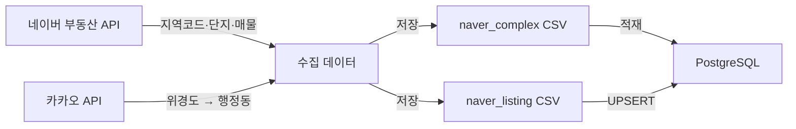
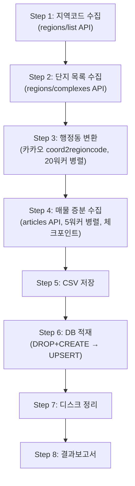
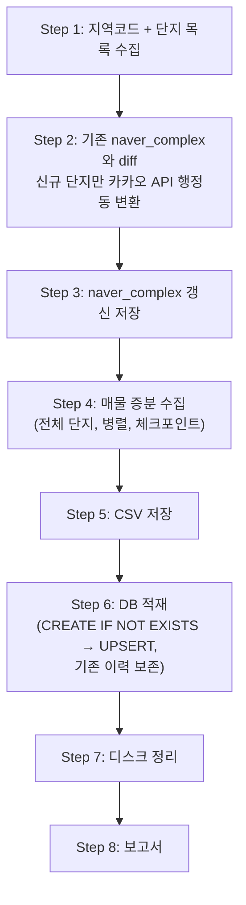

# 네이버 부동산 매물 수집 및 데이터 인사이트 가이드

## 목차

1. [시스템 개요](#1-시스템-개요)
2. [실행 방법](#2-실행-방법)
3. [처리 단계](#3-처리-단계)
4. [테이블 구조 및 컬럼 설명](#4-테이블-구조-및-컬럼-설명)
5. [증분 수집과 매물 이력 관리](#5-증분-수집과-매물-이력-관리)
6. [출력 파일](#6-출력-파일)
7. [매물 이력 데이터를 활용한 시장 인사이트](#7-매물-이력-데이터를-활용한-시장-인사이트)
8. [핵심 기술](#8-핵심-기술)
9. [운영 가이드](#9-운영-가이드)
10. [유의사항 및 트러블슈팅](#10-유의사항-및-트러블슈팅)

---

## 1. 시스템 개요

`collect_naver_listing.py`는 네이버 부동산에서 서울/인천/경기 아파트 매물 호가를 수집하고, **카카오 API를 통해 행정동으로 변환**하여 PostgreSQL DB에 적재하는 스크립트입니다.

### 핵심 특징

| 항목 | 설명 |
|:--|:--|
| 수집 방식 | 증분(Incremental) — 매물 이력을 누적 보존 |
| 수집 모드 | `full` (최초 전체), `daily` (매일 증분) |
| 행정동 변환 | 카카오 `coord2regioncode` API (위경도 → 행정동) |
| 병렬 처리 | ThreadPoolExecutor — 매물 수집 5워커, 행정동 변환 20워커 |
| 체크포인트 | 200단지마다 JSON 저장, `--resume`으로 중단 지점 복구 |
| 디스크 관리 | 수집 완료 후 이전 날짜 CSV 자동 삭제 |

### 데이터 흐름



---

## 2. 실행 방법

```bash
# 최초 전체 수집 (지역코드 → 단지 → 행정동 변환 → 매물)
python collect_naver_listing.py full

# 매일 증분 수집 (신규 단지 자동 반영 + 매물)
python collect_naver_listing.py daily

# 중단된 수집을 이어받기
python collect_naver_listing.py daily --resume

# 테스트 모드 (소규모, 10개 동·20개 단지)
python collect_naver_listing.py full --test

# DB 저장 생략 (CSV만 생성)
python collect_naver_listing.py full --skip-db
```

| 매개변수 | 설명 |
|:--|:--|
| `full` | 지역코드·단지·행정동·매물 전 과정 실행 |
| `daily` | 기존 단지 정보에서 신규 단지만 diff + 매물 수집 |
| `--resume` | 체크포인트에서 중단 지점 복구 (daily/full 모두 가능) |
| `--test` | 10개 동, 20개 단지만 수집하는 테스트 모드 |
| `--skip-db` | PostgreSQL 적재를 건너뛰고 CSV만 저장 |

---

## 3. 처리 단계

### `full` 모드



### `daily` 모드



> [!NOTE]
> `daily` 모드에서도 지역코드+단지목록을 재수집하여 **신규 단지를 자동으로 감지**합니다. 기존 단지는 그대로 유지하고 신규 단지만 카카오 API로 행정동을 변환하므로 추가 소요 시간은 미미합니다.

> [!IMPORTANT]
> **DB 처리 방식이 모드별로 다릅니다:**
> - `full`: 테이블을 **DROP + CREATE** 후 전체 데이터 INSERT (초기화)
> - `daily`: 테이블이 없을 때만 **CREATE IF NOT EXISTS**, 이후 **UPSERT**로 기존 매물 이력(`is_active=False` 포함)을 보존하면서 가격/날짜/상태만 갱신

---

## 4. 테이블 구조 및 컬럼 설명

### 4.1 `naver_complex` — 네이버 단지 정보

| 컬럼 | 타입 | 설명 |
|:--|:--|:--|
| `complex_no` | VARCHAR(20) PK | 네이버 단지 고유번호 |
| `complex_name` | VARCHAR(100) | 네이버 등록 단지명 |
| `sido_name` | VARCHAR(20) | 시도명 (서울특별시, 경기도, 인천광역시) |
| `sgg_name` | VARCHAR(50) | 시군구명 (강남구, 수원시 등) |
| `dong_name` | VARCHAR(50) | **행정동명** (카카오 API 변환, 예: 개포2동) |
| `latitude` | FLOAT | 위도 (WGS84) |
| `longitude` | FLOAT | 경도 (WGS84) |

> [!IMPORTANT]
> `dong_name`은 네이버 API의 법정동(개포동)이 아닌, **카카오 `coord2regioncode` API로 변환된 행정동(개포2동)**입니다. 행정동 기준 분석이 필요할 때 이 컬럼을 사용합니다.

### 4.2 `naver_listing` — 네이버 매물 (슬림화)

| 컬럼 | 타입 | 설명 |
|:--|:--|:--|
| `article_no` | VARCHAR(20) PK | 네이버 매물 고유번호 |
| `complex_no` | VARCHAR(20) FK | 네이버 단지번호 (→ naver_complex 조인) |
| `trade_type` | VARCHAR(10) | 거래유형: A1=매매, B1=전세, B2=월세 |
| `exclusive_area` | INTEGER | 전용면적 (㎡, 정수) |
| `initial_price` | INTEGER | 최초 등록 호가 (만원) |
| `current_price` | INTEGER | 현재 호가 (만원, 가격 변경 시 갱신) |
| `rent_price` | INTEGER | 월세 (만원, B2인 경우만) |
| `floor_info` | VARCHAR(10) | 층 정보 |
| `direction` | VARCHAR(10) | 향 (남향, 동향 등) |
| `confirm_date` | DATE | 매물 확인 일자 (중개소 인증일) |
| `first_seen_date` | DATE | 최초 수집 일자 (시장 진입 시점 추정) |
| `last_seen_date` | DATE | 마지막 확인 일자 (종료 시점) |
| `is_active` | BOOLEAN | 현재 활성 여부 (True=노출 중, False=종료) |

> [!TIP]
> 지역 정보(시도/시군구/행정동)가 필요하면 `complex_no`로 `naver_complex` 테이블을 조인합니다:
> ```sql
> SELECT l.*, c.sgg_name, c.dong_name
> FROM naver_listing l
> JOIN naver_complex c ON l.complex_no = c.complex_no;
> ```

---

## 5. 증분 수집과 매물 이력 관리

매일 스크립트가 실행되면 각 매물은 다음과 같이 분류·처리됩니다:

| 상태 | 조건 | 처리 |
|:--|:--|:--|
| **신규 (New)** | 오늘 처음 발견된 매물번호 | `first_seen_date` = 오늘, `is_active` = True |
| **유지 (Existing)** | 어제도 있고 오늘도 있는 매물 | `last_seen_date` = 오늘로 갱신, 가격 변동 시 `current_price` 갱신 |
| **종료 (Closed)** | 어제까지 있었으나 오늘 사라진 매물 | `is_active` = False로 변경 (데이터 삭제 아님) |

> [!IMPORTANT]
> 거래 완료되거나 노출 종료된 매물은 **삭제되지 않고 `is_active=False`로 상태만 변경**됩니다. 이를 통해 매물 이력(시장 체류 기간, 가격 변동 등)이 영구적으로 보존되어 시계열 분석에 활용할 수 있습니다.

---

## 6. 출력 파일

| 파일 | 내용 |
|:--|:--|
| `naver_complex_YYYYMMDD.csv` | 단지 정보 (단지코드, 단지명, 시도, 시군구, 행정동, 위경도) |
| `naver_listing_YYYYMMDD.csv` | 매물 데이터 (호가, 거래유형, 면적, 이력 등) |
| `naver_collection_report_YYYYMMDD.txt` | 수집 결과 보고서 |

> [!NOTE]
> 수집 완료 후 **이전 날짜의 CSV 파일은 자동 삭제**됩니다 (디스크 절약). `datas/` 폴더에는 항상 최신 날짜 파일만 보존됩니다.

---

## 7. 매물 이력 데이터를 활용한 시장 인사이트

증분 업데이트를 통해 누적된 이력 데이터를 분석하면, 단순 호가를 넘어 **부동산 시장의 깊이 있는 선행 지표**를 도출할 수 있습니다.

### 인사이트 1. 시장 소화력 (Market Liquidity) 및 매수 심리 분석

* **매물 소요 기간 (Days on Market, DoM)**
  * **산식:** `last_seen_date` - `first_seen_date` (단, `is_active=False`인 경우)
  * **해석:**
    * DoM이 짧아짐 ➜ 거래가 활발한 "매도자 우위(Seller's Market)"
    * DoM이 길어짐 ➜ 매물 적체, "매수자 우위(Buyer's Market)" 진입 신호

* **재고 회전율 (Inventory Turnover)**
  * **방법:** 일/주간 신규 등록 매물 수 대비 종료(`is_active=False`) 매물 수의 비율
  * **해석:** 소화 속도가 공급을 초과하면 가격 상승, 반대면 가격 하락 신호

### 인사이트 2. 매도자의 심리 및 네고(협상) 가능성 파악

* **호가 조정률 (Price Adjustment Rate)**
  * **산식:** `(current_price - initial_price) / initial_price * 100` (%)
  * **해석:** 가격 하향 변경이 잦으면 매도자 조급 → 급매 출현 시그널

* **네고 타겟팅 기회 발굴**
  * **조건:** `is_active=True` & DoM 장기화 & `current_price` < `initial_price`
  * **해석:** 장기간 미판매 + 가격 인하 이력 = 추가 네고 여지가 높은 매물

### 인사이트 3. 실거래가 갭 추적 및 시장 방향 시그널

* **호가-실거래가 스프레드 (Spread)**
  * **방법:** 종료 매물(`is_active=False`)의 호가와 국토부 `apt_trade_master` 실거래가를 매칭
  * **해석:**
    * 침체기: 갭이 큼 (호가 > 실거래가)
    * 상승장: 갭이 줄어들거나 역전 (호가 ≤ 실거래가)

### 인사이트 4. 거시적/지역적 트렌드 이동의 조기 포착

* **지역별 매물 소진 속도 비교**
  * **방법:** `naver_complex`의 `sgg_name`, `dong_name`(행정동)별 DoM 및 신규/종료 추이 비교
  * **해석:** 특정 지역의 전세 매물 소진 속도가 급변하면, 공식 통계보다 **수주~수개월 빠르게** 갭투자 수요나 실수요 이동을 포착할 수 있는 선행 지표로 활용

---

## 8. 핵심 기술

| 기술 | 설명 |
|:--|:--|
| **TLS Fingerprint 모방** | `curl_cffi` 라이브러리로 Chrome TLS fingerprint를 모방하여 봇 감지 우회 |
| **JWT 토큰 자동 추출** | 메인 페이지 HTML에서 Bearer 토큰을 자동 추출하여 API 인증 |
| **적응형 딜레이** | 연속 성공 시 0.8초까지 감소, 429 에러 시 3.5초까지 증가 (자동 조절) |
| **UPSERT (ON CONFLICT)** | `article_no`/`complex_no` 기준으로 기존 데이터의 필드만 갱신, 신규는 INSERT |
| **모드별 DB 전략** | `full`: DROP+CREATE (초기화), `daily`: CREATE IF NOT EXISTS (이력 보존) |
| **체크포인트** | 200단지마다 JSON으로 진행 상황 저장, `--resume`으로 중단 지점 복구 |
| **카카오 행정동 변환** | `coord2regioncode` API에서 `region_type='H'`의 `region_3depth_name` 추출 |

---

## 9. 운영 가이드

### 9.1 일일 자동 업데이트 (cron 설정)

```bash
# crontab -e
# 매일 04:00 — 네이버 매물 수집
0 4 * * * cd /path/to/project && .venv/bin/python collect_naver_listing.py daily >> logs/naver.log 2>&1
```

> [!TIP]
> Dokploy의 스케줄러 기능을 사용하면 cron 대신 웹 UI에서 설정할 수 있습니다.

### 9.2 수집이 중간에 끊겼을 때

```bash
python collect_naver_listing.py daily --resume
```

체크포인트 파일(`checkpoint_listing_YYYYMMDD.json`)이 있으면 중단 지점에서 자동으로 재개됩니다.

### 9.3 신규 단지 반영

`daily` 모드에서 **자동으로 신규 단지를 감지**합니다. 별도의 `full` 재실행이 필요하지 않습니다. 다만, 최초 실행은 반드시 `full` 모드로 해야 합니다.

---

## 10. 유의사항 및 트러블슈팅

| 증상 | 원인 | 해결 방법 |
|:--|:--|:--|
| `Rate limit (429)` 반복 | 네이버 API 호출 빈도 초과 | 적응형 딜레이가 자동 대응. 심할 경우 시간 간격을 두고 재실행 |
| 행정동이 `None` 다수 | 카카오 API 키 미설정 또는 위경도 0 | `.env`의 `KAKAO_API_KEY` 확인, 단지 위경도 데이터 확인 |
| `기존 naver_complex 파일이 없습니다` | `daily` 모드 실행 시 | `full` 모드를 먼저 1회 실행하세요 |
| DB 연결 실패 | PostgreSQL 미실행 | `.env` 파일의 `POSTGRES_*` 접속 정보 확인 |

> [!WARNING]
> 네이버 부동산 API는 비공식이며 변경될 수 있습니다. 개인 학습/연구 목적으로만 사용하세요.

### 성능 참고

| 작업 | 예상 소요 시간 |
|:--|:--|
| 지역코드 수집 (서울·인천·경기) | ~5분 |
| 단지 목록 수집 (~12,000건) | ~30분 |
| 행정동 변환 (카카오 API, 20워커) | ~10분 |
| 매물 수집 (전체, 5워커) | ~2–4시간 |
| 매물 수집 (테스트) | ~5분 |
| DB 적재 | ~5분 |

### DB 스키마 요약

PostgreSQL에 2개 테이블이 생성됩니다:

| 테이블 | Primary Key | 설명 |
|:--|:--|:--|
| `naver_complex` | `complex_no` | 네이버 단지 정보 (행정동·위경도 포함) |
| `naver_listing` | `article_no` | 네이버 매물 (UPSERT 증분 관리) |

#### 모드별 DB 처리 방식

| 구분 | `full` 모드 | `daily` 모드 |
|:--|:--|:--|
| 스키마 | **DROP + CREATE** (초기화) | **CREATE IF NOT EXISTS** (기존 보존) |
| naver_complex | UPSERT (staging → ON CONFLICT) | UPSERT (동일) |
| naver_listing | UPSERT (staging → ON CONFLICT) | UPSERT (기존 이력 보존) |

시맨틱 메타데이터: 모든 테이블과 컬럼에 `COMMENT ON` 문이 적용되어, **Text-to-SQL** 서비스에서 LLM이 스키마를 이해하는 데 활용됩니다.
