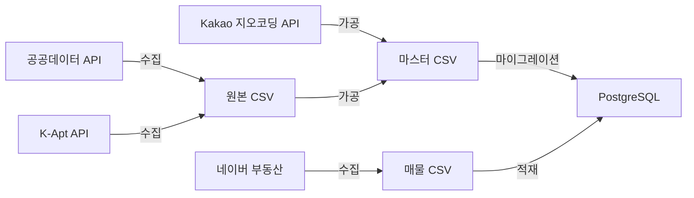
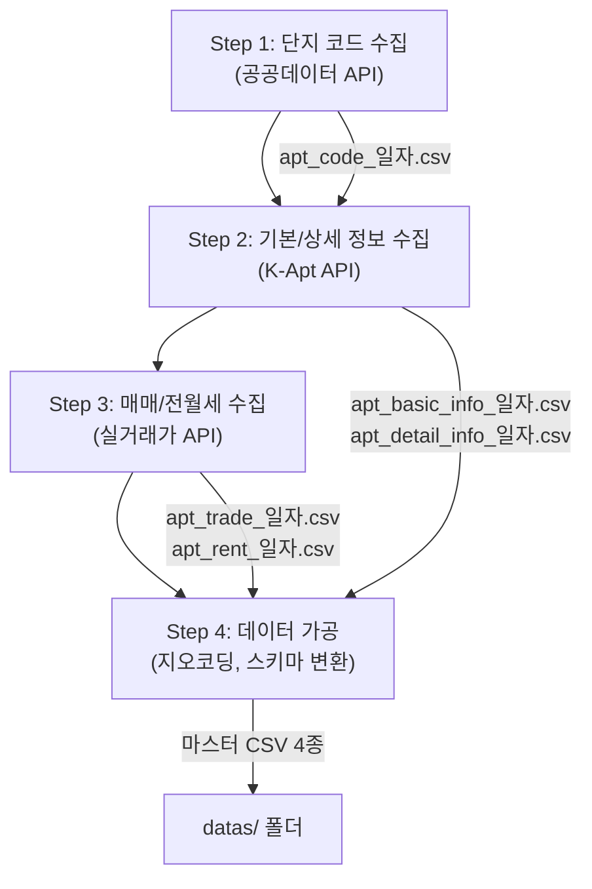
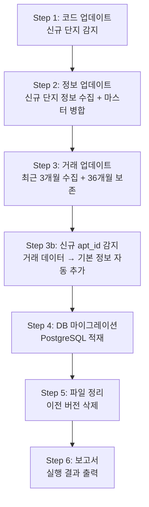
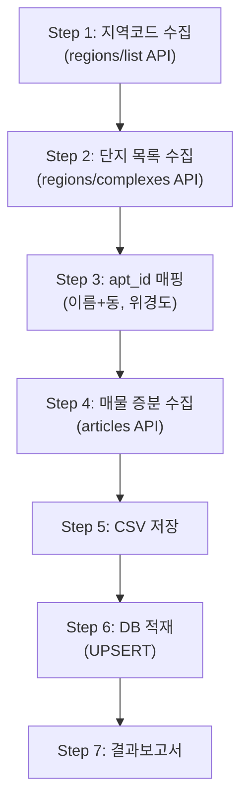

# 아파트 데이터 수집·가공·분석 시스템 운영 매뉴얼

## 목차

1. [시스템 개요](#1-시스템-개요)
2. [파일 구조](#2-파일-구조)
3. [환경 설정](#3-환경-설정)
4. [단계 1: 데이터 수집 — `collect_and_process.py`](#4-단계-1-데이터-수집)
5. [단계 2: 데이터 가공 — `update_and_migrate.py`](#5-단계-2-데이터-가공)
6. [단계 3: 데이터 업데이트 — 일일 운영](#6-단계-3-데이터-업데이트)
7. [Script 3 — 네이버 매물 수집 (`collect_naver_listing.py`)](#7-script-3--네이버-매물-수집)
8. [공통 유틸리티 (`utils.py`)](#8-공통-유틸리티)
9. [데이터 파일 규격](#9-데이터-파일-규격)
10. [DB 스키마](#10-db-스키마)
11. [VPS 배포 및 운영 가이드](#11-vps-배포-및-운영-가이드)
12. [유의사항 및 트러블슈팅](#12-유의사항-및-트러블슈팅)

---

## 1. 시스템 개요

본 시스템은 **공공데이터포털**, **K-Apt API**, **네이버 부동산**에서 아파트 관련 데이터를 수집·가공하고, **PostgreSQL** DB로 적재하여 Text-to-SQL 분석에 활용하는 파이프라인입니다.

### 핵심 기능

| 기능 | 담당 스크립트 | 설명 | 실행 빈도 |
|:--|:--|:--|:--|
| 최초 수집+가공 | `collect_and_process.py` | 단지코드, 기본/상세정보, 매매/전월세 수집 및 가공 | 최초 1회 |
| 일일 업데이트 | `update_and_migrate.py` | 증분 수집 + 마스터 병합 + DB 적재 | 매일 1회 |
| 네이버 매물 수집 | `collect_naver_listing.py` | 네이버 부동산 호가/매물 수집 | 매일 1회 |

### 데이터 흐름



---

## 2. 파일 구조

```
APT_Data_Collection_Manipulation/
│
├── .env                          # 환경 변수 (API 키, DB 접속 정보)
├── .gitignore                    # Git 제외 파일 목록
├── pyproject.toml                # 프로젝트 의존성
├── README.md                     # 프로젝트 소개
│
├── utils.py                      # 공통 유틸리티 (API, DB, 파일 관리)
├── collect_and_process.py        # [Script 1] 최초 데이터 수집 + 가공
├── update_and_migrate.py         # [Script 2] 일일 업데이트 + DB 마이그레이션
├── collect_naver_listing.py      # [Script 3] 네이버 매물 수집
│
├── docs/                         # 문서
│   ├── 아파트 데이터 수집(최초).md
│   ├── 아파트 데이터 가공(최초).md
│   └── 사용자_매뉴얼.md             # 본 매뉴얼
│
└── datas/                        # 데이터 (.gitignore로 제외)
    ├── apt_code_YYYYMMDD.csv
    ├── apt_basic_info_master_YYYYMMDD.csv
    ├── apt_detail_info_master_YYYYMMDD.csv
    ├── apt_trade_master_YYYYMMDD.csv
    ├── apt_rent_master_YYYYMMDD.csv
    ├── naver_complex_mapping_YYYYMMDD.csv
    ├── naver_listing_YYYYMMDD.csv
    └── naver_collection_report_YYYYMMDD.txt
```

> [!IMPORTANT]
> `datas/` 폴더에는 **최신 날짜의 마스터 파일만** 보존됩니다. `update_and_migrate.py` 실행 시 이전 버전 파일이 자동 삭제됩니다.

---

## 3. 환경 설정

### 3.1 `.env` 파일

프로젝트 루트에 `.env` 파일이 필요합니다. 아래 항목을 설정하세요:

```env
# 공공데이터포털 API 키 (일반 인증키 - Encoding)
DATA_API_KEY=여기에_API_키_입력

# Kakao 개발자 REST API 키 (지오코딩용)
KAKAO_API_KEY=여기에_API_키_입력

# PostgreSQL 접속 정보
POSTGRES_USER=postgres
POSTGRES_PASSWORD=비밀번호
POSTGRES_HOST=localhost
POSTGRES_PORT=5432
POSTGRES_DB=데이터베이스명
```

| 변수 | 용도 | 필수 |
|:--|:--|:--|
| `DATA_API_KEY` | 공공데이터포털 API 호출 | ✅ |
| `KAKAO_API_KEY` | 주소 → 위경도/행정동 변환 (지오코딩) | ✅ |
| `POSTGRES_*` | PostgreSQL DB 마이그레이션 | DB 사용 시 ✅ |

> [!TIP]
> `DATA_API_KEY`는 URL 인코딩된 값을 그대로 넣어도 됩니다. 시스템이 자동으로 디코딩합니다.

### 3.2 Python 의존성

```bash
# uv 사용 (권장)
uv sync

# 또는 pip 사용
pip install requests pandas xmltodict python-dotenv sqlalchemy psycopg2-binary python-dateutil curl-cffi
```

---

## 4. 단계 1: 데이터 수집

### 파일: `collect_and_process.py`

**용도**: 아파트 데이터를 **처음부터** 수집하고 가공하여 마스터 CSV를 생성합니다.

### 4.1 실행 방법

```bash
# 기본 실행 (서울·인천·경기, 최근 36개월)
python collect_and_process.py

# 지역 및 기간 지정
python collect_and_process.py --regions 11 28 41 --months 36

# 서울만 최근 12개월
python collect_and_process.py --regions 11 --months 12
```

| 매개변수 | 기본값 | 설명 |
|:--|:--|:--|
| `--regions` | `11 28 41` | 시도 코드 (공백 구분) |
| `--months` | `36` | 수집 기간 (개월) |

### 4.2 시도 코드 참조

| 코드 | 지역 | 코드 | 지역 |
|:--|:--|:--|:--|
| `11` | 서울특별시 | `28` | 인천광역시 |
| `41` | 경기도 | `26` | 부산광역시 |
| `27` | 대구광역시 | `29` | 광주광역시 |
| `30` | 대전광역시 | `31` | 울산광역시 |
| `36` | 세종특별자치시 | `43` | 충청북도 |
| `44` | 충청남도 | `45` | 전라북도 |
| `46` | 전라남도 | `47` | 경상북도 |
| `48` | 경상남도 | `50` | 제주특별자치도 |

### 4.3 처리 단계



#### Step 1: 단지 코드 수집

- **API**: `AptListService3/getSidoAptList3`
- **입력**: 시도 코드 목록
- **출력**: `apt_code_YYYYMMDD.csv`
- **내용**: 전국 아파트 단지 목록 (`kaptCode`, `kaptName`, `bjdCode` 등)
- **페이지네이션**: 자동 처리 (1000건/페이지)

#### Step 2: 기본/상세 정보 수집

- **API**: `AptBasisInfoServiceV4` (`getAphusBassInfoV4`, `getAphusDtlInfoV4`)
- **입력**: Step 1에서 수집한 `kaptCode` 목록
- **출력**: `apt_basic_info_YYYYMMDD.csv`, `apt_detail_info_YYYYMMDD.csv`
- **이어받기**: 기존 파일이 있으면 이미 수집된 코드를 건너뛰고 이어서 수집
- **API 호출 간격**: 0.1초

> [!NOTE]
> 약 20,000개 단지의 정보를 수집하므로 **수 시간이 소요**될 수 있습니다. 중단해도 다시 실행하면 이어서 수집합니다.

#### Step 3: 매매/전월세 거래 수집

- **API**: `RTMSDataSvcAptTradeDev` (매매), `RTMSDataSvcAptRent` (전월세)
- **입력**: `apt_code` 파일에서 추출한 LAWD_CD(5자리 지역코드) × 월 목록
- **출력**: `apt_trade_YYYYMMDD.csv`, `apt_rent_YYYYMMDD.csv`
- **429 오류 대응**: 지수 백오프 (5초 → 10초 → 20초 → 40초 → 80초, 최대 5회)

> [!WARNING]
> 공공데이터포털 API는 **일일 트래픽 제한**이 있습니다 (일반: 1,000건/일, 인증: 무제한). 36개월×다수 지역 수집 시 **인증키(활용 신청 완료)** 사용을 권장합니다.

#### Step 4: 데이터 가공

**4-1. 기본 정보 가공 (`process_basic_info`)**

1. 매매/전월세 원본에서 고유 아파트(`aptSeq`) 추출
2. 도로명/지번 주소 조합
3. **Kakao API**로 지오코딩 (위경도 + 행정동)
4. 20개 스레드 병렬 처리
5. 100건마다 중간 저장 (안전)

출력 스키마: `apt_id`, `apt_name`, `build_year`, `road_address`, `jibun_address`, `latitude`, `longitude`, `admin_dong`

**4-2. 상세 정보 가공 (`process_detail_info`)**

1. K-Apt 기본+상세 정보 병합 (`kaptCode` 기준)
2. `apt_basic`과 매핑 (이름+동 매칭 → 공간 매칭 순)
3. 컬럼 리네임 (한글 → snake_case)

매핑 순서:
1. **이름+행정동 매칭**: 단지명과 행정동이 모두 일치하는 경우
2. **공간 매칭** (50m 이내): 지오코딩 후 위경도 거리 비교

**4-3. 매매/전월세 가공 (`process_trade_rent`)**

1. `deal_date` 생성 (연·월·일 → YYYY-MM-DD)
2. 금액 정규화 (쉼표 제거, float 변환)
3. **시계열 분석 컬럼** 자동 계산:
   - 매매: `previous_deal_amount`, `deal_diff`, `deal_diff_rate`
   - 전월세: `rental_adjusted_deposit` (월세→전세 환산), `deposit_diff`, `deposit_diff_rate`

> [!NOTE]
> **환산 보증금 공식**: `보증금 + (월세 × 12 ÷ 0.045)`
> 월세를 연간 수익률 4.5%로 전환한 전세 환산 보증금입니다.

### 4.4 출력 파일

| 파일명 패턴 | 내용 | 크기 (참고) |
|:--|:--|:--|
| `apt_code_YYYYMMDD.csv` | 단지 목록 | ~0.8 MB |
| `apt_basic_info_master_YYYYMMDD.csv` | 기본 정보 (가공) | ~2.3 MB |
| `apt_detail_info_master_YYYYMMDD.csv` | 상세 정보 (가공) | ~3.1 MB |
| `apt_trade_master_YYYYMMDD.csv` | 매매 거래 (가공) | ~72 MB |
| `apt_rent_master_YYYYMMDD.csv` | 전월세 거래 (가공) | ~261 MB |

---

## 5. 단계 2: 데이터 가공

### 파일: `update_and_migrate.py`

**용도**: 기존 마스터를 기반으로 **증분 수집 → 병합 → DB 적재 → 파일 정리 → 보고서** 전 과정을 자동 수행합니다.

### 5.1 실행 방법

```bash
# 전체 실행 (업데이트 + DB + 정리)
python update_and_migrate.py

# DB 마이그레이션 건너뛰기
python update_and_migrate.py --skip-db

# 파일 정리 건너뛰기
python update_and_migrate.py --skip-cleanup
```

| 매개변수 | 설명 |
|:--|:--|
| `--skip-db` | PostgreSQL 마이그레이션 단계를 건너뜁니다 |
| `--skip-cleanup` | 이전 버전 파일 삭제를 건너뜁니다 |

### 5.2 처리 단계



#### Step 1: 코드 업데이트

1. `collect_and_process.py`의 `collect_apt_codes()` 호출 (서울·인천·경기)
2. 이전 `apt_code` 파일과 비교하여 **신규 단지 코드** 추출
3. 신규 코드가 없으면 Step 2의 수집은 건너뜀

#### Step 2: 정보 업데이트

1. 기존 마스터 로드 (`apt_basic_info_master_*.csv`, `apt_detail_info_master_*.csv`)
2. **RAW 마스터 감지**: `kaptCode`는 있지만 `latitude`가 없으면 자동 스키마 변환
3. 신규 코드에 대해 K-Apt API로 기본/상세 정보 증분 수집
4. 수집된 데이터를 가공 스키마로 변환 (지오코딩 포함)
5. 기존 마스터와 병합 (중복 제거: `apt_id` / `complex_id` 기준)
6. 새 마스터 저장

#### Step 3: 거래 업데이트

1. **수집 대상**: 최근 3개월 (당월, 전월, 전전월)
2. 전체 지역코드에 대해 매매/전월세 증분 수집
3. 수집된 데이터를 가공 스키마로 변환
4. **보존 정책**: 36개월 이전 데이터 삭제 (cutoff)
5. **덮어쓰기 정책**: 수집 대상 월의 기존 데이터를 삭제 후 신규 데이터로 교체
6. 새 마스터 저장

> [!IMPORTANT]
> 매매/전월세 데이터는 **최근 3개월만 다시 수집**합니다. 과거 데이터가 소급 수정되는 경우(취소 거래 반영 등)를 대비하여 당월뿐 아니라 직전 2개월도 함께 갱신합니다.

#### Step 3b: 신규 apt_id 감지 및 기본 정보 자동 추가

Step 3에서 수집한 매매/전월세 원본 데이터에 기존 `apt_basic_info_master`에 없는 **새로운 `apt_id`** 가 포함되어 있으면 자동으로 기본 정보를 생성하여 마스터에 추가합니다.

1. 수집된 거래 원본에서 고유 `aptSeq` 목록 추출
2. 기존 `apt_basic_info_master`의 `apt_id`와 비교
3. 신규 `apt_id`에 대해 원본 거래 데이터에서 **주소 정보** 추출:
   - `sggNm` + `roadNm` + `roadNmBonbun` / `roadNmBubun` → 도로명 주소
   - `sggNm` + `umdNm` + `jibun` → 지번 주소
   - `aptNm` → 아파트명, `buildYear` → 건축 연도
4. **Kakao API 지오코딩** (20 스레드 병렬 처리) → 위경도 + 행정동
5. 기존 마스터에 병합하여 새 마스터 저장

> [!NOTE]
> 이 기능은 **거래 데이터에만 존재하고 K-Apt에는 아직 등록되지 않은 아파트**를 자동으로 기본 정보에 추가합니다. 이를 통해 `apt_basic`과 `apt_trade`/`apt_rent` 간 `apt_id` 참조 무결성이 유지됩니다.

#### Step 4: DB 마이그레이션

1. **Drop & Create**: 기존 테이블을 삭제하고 스키마 재생성
2. **데이터 적재**: 최신 마스터 CSV → PostgreSQL (청크 단위)
3. **인덱스 생성**: 검색 성능 최적화용 인덱스 7개 생성
4. **시맨틱 메타데이터**: 테이블/컬럼에 한국어+영어 COMMENT 추가

> [!CAUTION]
> DB 마이그레이션은 **기존 테이블을 완전히 삭제(DROP)하고 재생성**합니다. DB에 직접 넣은 데이터가 있다면 백업 후 실행하세요.

#### Step 5: 파일 정리

자동 삭제 대상:
- 오늘 날짜가 아닌 이전 버전 마스터/코드 파일
- 중복 파일 (`apt_basic.csv`, `apt_details.csv`, `*_processed.csv` 등)
- 가공 전 원본 파일 (`apt_*_YYYYMMDD.csv` 중 master가 아닌 것)

> [!TIP]
> `--skip-cleanup` 옵션으로 파일 정리를 건너뛸 수 있습니다. 중요한 파일은 `datas/bak/`에 수동으로 백업해두세요.

#### Step 6: 보고서

실행 완료 시 콘솔에 다음 내용이 출력됩니다:

- 각 데이터 유형별 건수 (기본, 상세, 매매, 전월세)
- **거래 데이터 기반 신규 기본 정보 추가 건수** (Step 3b)
- DB 적재 건수 (테이블별)
- 삭제된 파일 목록
- 현재 보존 중인 마스터 파일 및 크기

---

## 6. 단계 3: 데이터 업데이트 — 일일 운영

매일 아래 두 스크립트를 순서대로 실행합니다.

```bash
# 1. 실거래 데이터 업데이트 + DB 마이그레이션
python update_and_migrate.py

# 2. 네이버 매물 수집
python collect_naver_listing.py
```

> [!TIP]
> cron 또는 Dokploy 스케줄러로 매일 자동 실행할 수 있습니다. 권장 시간: 새벽 2~4시 (API 부하 적음)

---

## 7. Script 3 — 네이버 매물 수집

### 파일: `collect_naver_listing.py`

**용도**: 네이버 부동산에서 서울/인천/경기 아파트 매물 호가를 수집하고, 기존 실거래 데이터(`apt_id`)와 매핑합니다.

### 7.1 실행 방법

```bash
# 전체 수집 (서울·인천·경기 전체, 약 1,370개 동)
python collect_naver_listing.py

# 테스트 모드 (10개 동만)
python collect_naver_listing.py --test

# DB 저장 없이 CSV만
python collect_naver_listing.py --skip-db
```

| 매개변수 | 설명 |
|:--|:--|
| `--test` | 10개 동, 20개 단지만 수집하는 테스트 모드 |
| `--skip-db` | PostgreSQL 적재를 건너뛰고 CSV만 저장 |

### 7.2 처리 단계



#### 핵심 기술

- **TLS Fingerprint 모방**: `curl_cffi` 라이브러리로 Chrome TLS fingerprint를 모방하여 봇 감지 우회
- **JWT 토큰 자동 추출**: 메인 페이지 HTML에서 Bearer 토큰을 자동 추출
- **증분 수집**: `article_no` 기반 UPSERT로 신규/가격변경/종료 자동 처리
- **apt_id 매핑**: 이름+동 매칭(정확) → 위경도 매칭(50m 이내) 순서

### 7.3 출력 파일

| 파일 | 내용 |
|:--|:--|
| `naver_complex_mapping_YYYYMMDD.csv` | 네이버 단지 ↔ apt_id 매핑 |
| `naver_listing_YYYYMMDD.csv` | 매물 데이터 (호가, 거래유형, 면적 등) |
| `naver_collection_report_YYYYMMDD.txt` | 수집 결과 보고서 |

### 7.4 매물 데이터 컬럼

| 컬럼 | 설명 |
|:--|:--|
| `article_no` | 네이버 매물 고유번호 (PK) |
| `apt_id` | 기존 아파트 코드 (매핑된 경우) |
| `sgg_name` | 시군구명 (행정구역) |
| `dong_name` | 행정동명 |
| `trade_type` | A1=매매, B1=전세, B2=월세 |
| `exclusive_area` | 전용면적 (㎡, 정수) |
| `current_price` | 현재 호가 (만원) |
| `first_seen_date` | 최초 등장일 |
| `last_seen_date` | 마지막 확인일 |
| `is_active` | 현재 활성 여부 |

> [!WARNING]
> 네이버 부동산 API는 비공식이며 변경될 수 있습니다. 개인 학습/연구 목적으로만 사용하세요.

---

## 8. 공통 유틸리티

### 파일: `utils.py`

두 스크립트가 공유하는 기반 모듈입니다.

| 함수 | 설명 |
|:--|:--|
| `fetch_data(url, params)` | API 호출 + 429 지수 백오프 + XML/JSON 자동 파싱 |
| `save_to_csv(data_list, filename)` | 딕셔너리 리스트 → `datas/` 폴더에 CSV 저장 |
| `get_today_str()` | 오늘 날짜를 `YYYYMMDD` 형식으로 반환 |
| `get_latest_file(pattern)` | `datas/` 폴더에서 패턴에 맞는 최신 파일 반환 |
| `get_db_engine()` | PostgreSQL SQLAlchemy 엔진 반환 |
| `get_api_key_decoded()` | URL 인코딩된 API 키를 디코딩하여 반환 |

| 상수 | 설명 |
|:--|:--|
| `DATA_API_KEY` | 공공데이터포털 인증키 |
| `KAKAO_API_KEY` | Kakao REST API 키 |
| `DATA_DIR` | 데이터 저장 경로 (`"datas"`) |

---

## 9. 데이터 파일 규격

### 7.1 `apt_basic_info_master` — 아파트 기본 정보

| 컬럼 | 타입 | 설명 |
|:--|:--|:--|
| `apt_id` | string | 아파트 고유 코드 (매매/전월세의 `aptSeq`) |
| `apt_name` | string | 아파트 단지명 |
| `build_year` | int | 건축 연도 |
| `road_address` | string | 도로명 주소 |
| `jibun_address` | string | 지번 주소 |
| `latitude` | float | 위도 (WGS84) |
| `longitude` | float | 경도 (WGS84) |
| `admin_dong` | string | 행정동명 (예: 역삼1동) |

### 7.2 `apt_detail_info_master` — 아파트 상세 정보

| 컬럼 | 타입 | 설명 |
|:--|:--|:--|
| `complex_id` | string | K-Apt 단지 코드 (`kaptCode`) |
| `apt_id` | string | 매매 데이터와 연결용 (매칭된 경우) |
| `complex_name` | string | 단지명 |
| `household_count` | int | 총 세대수 |
| `approval_date` | date | 사용 승인일 |
| `total_parking_count` | int | 총 주차대수 (지상+지하) |
| `sale_type` | string | 분양 형태 |
| `apartment_type` | string | 아파트 유형 |
| `convenient_facilities` | text | 편의 시설 |
| `education_facilities` | text | 교육 시설 |
| `bus_station_walking_time` | string | 버스 정류장 도보 시간 |
| `subway_station_walking_time` | string | 지하철역 도보 시간 |
| `subway_line` | text | 인근 지하철 노선 |
| `subway_station` | text | 인근 지하철역 |

### 7.3 `apt_trade_master` — 매매 실거래가

| 컬럼 | 타입 | 설명 |
|:--|:--|:--|
| `apt_id` | string | 아파트 고유 코드 |
| `apartment_name` | string | 아파트명 |
| `deal_date` | date | 거래일 (YYYY-MM-DD) |
| `deal_amount` | float | 거래 금액 (만원) |
| `exclusive_area` | float | 전용 면적 (㎡) |
| `floor` | int | 층수 |
| `buyer_type` | string | 매수자 유형 |
| `seller_type` | string | 매도자 유형 |
| `dealing_type` | string | 거래 유형 |
| `registration_date` | string | 등기 일자 |
| `previous_deal_amount` | float | 직전 거래 금액 (만원) |
| `deal_diff` | float | 가격 변동 (만원) |
| `deal_diff_rate` | float | 가격 변동률 (%) |

### 7.4 `apt_rent_master` — 전월세 실거래가

| 컬럼 | 타입 | 설명 |
|:--|:--|:--|
| `apt_id` | string | 아파트 고유 코드 |
| `apartment_name` | string | 아파트명 |
| `deal_date` | date | 거래일 |
| `deposit` | float | 보증금 (만원) |
| `monthly_rent` | float | 월세 (만원, 전세 시 0) |
| `rental_adjusted_deposit` | float | 환산 보증금 (만원) |
| `exclusive_area` | float | 전용 면적 (㎡) |
| `floor` | int | 층수 |
| `contract_term` | string | 계약 기간 |
| `contract_type` | string | 계약 유형 (신규/갱신) |
| `deposit_diff` | float | 환산 보증금 변동 (만원) |
| `deposit_diff_rate` | float | 환산 보증금 변동률 (%) |

---

## 10. DB 스키마

PostgreSQL에 6개 테이블이 생성됩니다.

| 테이블 | Primary Key | 담당 스크립트 | 설명 |
|:--|:--|:--|:--|
| `apt_basic` | `apt_id` | update_and_migrate | 아파트 기본 정보 |
| `apt_detail` | `complex_id` | update_and_migrate | 아파트 상세 시설 정보 |
| `apt_trade` | `id` (auto) | update_and_migrate | 매매 실거래가 |
| `apt_rent` | `id` (auto) | update_and_migrate | 전월세 실거래가 |
| `naver_complex_mapping` | `naver_complex_no` | collect_naver_listing | 네이버 단지 ↔ apt_id 매핑 |
| `naver_listing` | `article_no` | collect_naver_listing | 네이버 매물 (UPSERT) |

### 시맨틱 메타데이터

모든 테이블과 주요 컬럼에 `COMMENT ON` 문이 적용됩니다. 이는 **Text-to-SQL** 서비스에서 LLM이 스키마를 이해하는 데 활용됩니다.

---

## 11. VPS 배포 및 운영 가이드

### 11.1 최초 배포 (Hostinger VPS + Dokploy)

```bash
# 1. GitHub에서 클론
git clone https://github.com/datainworld/apt-data-collection-manipulation.git
cd apt-data-collection-manipulation

# 2. Python 가상환경 생성 및 의존성 설치
uv venv
uv sync

# 3. .env 파일 생성
cp .env.example .env
# DATA_API_KEY, KAKAO_API_KEY, POSTGRES_* 설정

# 4. 데이터 수집 (최초 1회, 약 8~12시간)
python collect_and_process.py --regions 11 28 41 --months 36

# 5. DB 마이그레이션
python update_and_migrate.py

# 6. 네이버 매물 최초 수집
python collect_naver_listing.py
```

### 11.2 일일 자동 업데이트 (cron 설정)

```bash
# crontab -e
# 매일 02:00 — 실거래 데이터 업데이트
0 2 * * * cd /path/to/project && .venv/bin/python update_and_migrate.py >> logs/update.log 2>&1

# 매일 04:00 — 네이버 매물 수집
0 4 * * * cd /path/to/project && .venv/bin/python collect_naver_listing.py >> logs/naver.log 2>&1
```

> [!TIP]
> Dokploy의 스케줄러 기능을 사용하면 cron 대신 웹 UI에서 설정할 수 있습니다.

### 11.3 수집이 중간에 끊겼을 때

**같은 명령을 다시 실행**하면 됩니다:
- **단지 정보**: 이미 수집된 코드를 건너뛰고 이어 수집
- **지오코딩**: 100건마다 중간 저장
- **네이버 매물**: 증분(UPSERT) 방식이므로 재실행 안전

---

## 12. 유의사항 및 트러블슈팅

### API 관련

| 증상 | 원인 | 해결 방법 |
|:--|:--|:--|
| `Rate limit hit (429)` 반복 | API 일일 호출 한도 초과 | 다음 날 다시 실행하거나, 인증키로 전환 |
| `API Error: SERVICE_KEY_IS_NOT_REGISTERED_ERROR` | API 키 미등록 | 공공데이터포털에서 활용 신청 완료 확인 |
| 지오코딩 결과 `None` 다수 | 주소 형식 불일치 | Kakao API 키 유효성 확인, 주소 데이터 확인 |

### DB 관련

| 증상 | 원인 | 해결 방법 |
|:--|:--|:--|
| `DB 연결 오류` | PostgreSQL 미실행 또는 접속 정보 오류 | `.env` 파일 확인, PostgreSQL 서버 상태 확인 |
| `StringDataRightTruncation` | 컬럼 크기 초과 | `subway_line`, `subway_station`은 `TEXT` 타입 사용 중 (이미 대응) |
| `sqlalchemy` 버전 오류 | SQLAlchemy 1.x 호환 문제 | `pip install sqlalchemy>=2.0` |

### 데이터 관련

| 상황 | 설명 |
|:--|:--|
| `apt_id`와 `complex_id`의 차이 | `apt_id`는 실거래가 API의 `aptSeq`, `complex_id`는 K-Apt의 `kaptCode`. 서로 다른 코드 체계 |
| 상세 정보 매칭률 100% 미달 | 단지명/위치 기반 매칭이므로 일부 불일치 가능. 미매칭 건은 `apt_id`가 `NULL` |
| `deal_diff`가 `NaN` | 해당 아파트·면적의 첫 거래이므로 직전 거래가 없음 |
| 전월세 `monthly_rent = 0` | 전세 거래, `rental_adjusted_deposit = deposit`과 동일 |

### 성능 참고

| 작업 | 예상 소요 시간 |
|:--|:--|
| 단지 코드 수집 (서울·인천·경기) | ~5분 |
| 기본/상세 정보 수집 (20,000건) | ~3–5시간 |
| 매매 데이터 수집 (36개월) | ~2–4시간 |
| 전월세 데이터 수집 (36개월) | ~3–5시간 |
| 기본 정보 지오코딩 (20,000건) | ~30분 |
| DB 마이그레이션 | ~5–10분 |
| 일일 업데이트 (3개월분) | ~30분–1시간 |
| 네이버 매물 수집 (전체) | ~2–4시간 |
| 네이버 매물 수집 (테스트) | ~5분 |
